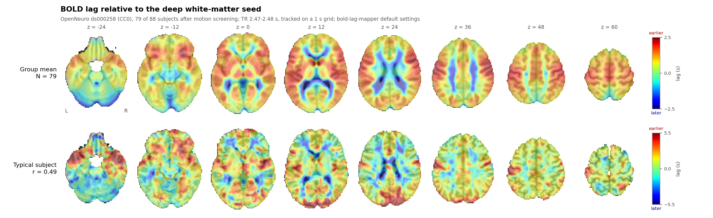
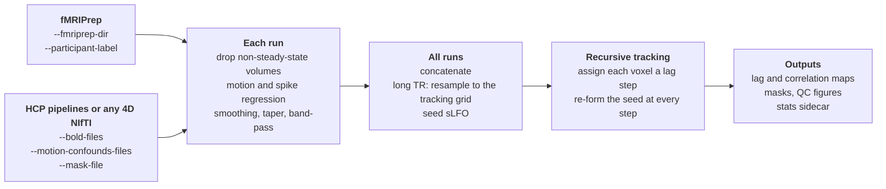
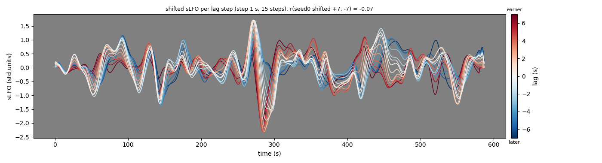

# fMRIPrep-BOLDLagMapping

Voxelwise BOLD lag mapping for [fMRIPrep](https://fmriprep.org) derivatives, and for HCP-pipeline outputs or any
other 4D NIfTI data.

`bold-lag-mapper` estimates, for every voxel, the time shift (in seconds) at which the systemic low-frequency
oscillation (sLFO) of the resting-state BOLD signal reaches that voxel, relative to a seed region. The result
is a map of haemodynamic transit timing. The tracking algorithm is a Python implementation of the recursive
lag tracking of Dr Toshihiko Aso's MATLAB scripts (`drLag4Drev7`, `Einsteining`); this package adds the input
handling, masks, spike detection and outputs needed to run it directly on fMRIPrep outputs.

Dr Aso also maintains the official Python port of his MATLAB code,
**[boldlag](https://github.com/RIKEN-BCIL/HCPstyle-BOLDLagMappingAndCleaning)**, which reproduces the MATLAB
results bit for bit and is organised around the HCP directory layout; use it when you need exact agreement with the
MATLAB scripts. This package reads fMRIPrep derivatives directly (`--fmriprep-dir`) and takes HCP-pipeline outputs
or any other 4D NIfTI data as explicit files. [docs/comparison_with_boldlag.md](docs/comparison_with_boldlag.md)
lists every difference between the two, with the code on both sides.



*Lag maps made with the default settings from the fMRIPrep outputs of OpenNeuro
[ds000258](https://doi.org/10.18112/openneuro.ds000258.v1.0.0) (CC0). Top: the mean over the subjects that passed a
framewise-displacement screen. Bottom: one subject, chosen by rule as the one whose agreement with the mean of the
others is the median. Red is earlier and blue later than the bundled deep white-matter seed.*

## Why use it with fMRIPrep

| What fMRIPrep gives you | What this package does with it | Where |
|---|---|---|
| `sub-<label>/[ses-*/]func/*_desc-preproc_bold.nii.gz`, masks and confounds | `--fmriprep-dir DIR --participant-label LABEL` finds every run of the subject, pairs each with its own confounds file, takes the first run's brain mask, drops runs shorter than `--min-volumes`, and checks that all runs share one TR (NIfTI header and JSON `RepetitionTime`). Several sessions, tasks or resolutions without a selection stop the run instead of being mixed. | `fmriprep.py` |
| `*_desc-confounds_timeseries.tsv` | The six rigid-body parameters are read **by column name**, with their backward and forward differences and framewise displacement as nuisance regressors (19 columns). | `io.load_motion_confounds`, `lag_preprocess.calculate_motion_derivatives_and_fd` |
| `non_steady_state_outlier_XX` columns | The leading non-steady-state volumes are removed from the BOLD and the confounds of each run before anything else. | `io.count_leading_non_steady_state` |
| `framewise_displacement` column | A frame is a spike if DVARS flags it **or** FD exceeds `--fd-spike-threshold`; the preceding frame is included. | `io.load_framewise_displacement`, `lag_preprocess` |
| A BOLD series that is not zero outside the brain | DVARS is computed on the undilated brain mask only, so the noisy ring outside the brain cannot dominate it. | `core.process_runs` |
| `space-T1w` runs and the `from-MNI152NLin2009cAsym_to-T1w` / `from-T1w_to-MNI152NLin2009cAsym` `.h5` transforms | Processing in the subject's space (`--native-space`, the default of `--fmriprep-dir`); the seed is moved into T1w space, and the lag and correlation maps and the masks are written in MNI152NLin2009cAsym (the pre-fill and raw lag maps stay in T1w space). Only the MNI152NLin2009cAsym transforms are accepted; if they are missing the run stops. | `io.setup_native_space_processing`, `io.find_transform_files`, `io.warp_to_mni_and_save` |
| MNI152NLin2009cAsym as the standard space | A deep white-matter seed mask on fMRIPrep's 2 mm MNI152NLin2009cAsym grid ships with the package and is used by default. | `seeds.py`, `bold_lag_mapper/data/` |
| Several runs per subject | Each run is cleaned and tapered separately, then the runs are concatenated and the lag is estimated once, as in the original pipeline. Output names keep the BIDS entities that are common to all runs. | `core.process_runs` |
| Long-TR acquisitions (e.g. TR 2.5 s) | The filtered series is resampled to a 1 s tracking grid when TR ≥ 1.5 s, the approach of the original long-TR scripts. | `core.resolve_tracking_step` |

## How it works



The seed's sLFO is followed one lag step at a time in both directions: voxels whose correlation with the current
seed peaks at that step (above `--min-corr-threshold`) are given that lag, and their mean becomes the seed of the
next step ([docs/design_notes.md](docs/design_notes.md)). The QC figure below (written with `--save-carpet-map`, from
the subject in the bottom row above) draws the seed of every step shifted back to the voxels it represents.



## Installation

Python ≥ 3.9. From a clone of this repository:

```
pip install .              # core: nibabel, numpy, scipy, nilearn, matplotlib, pandas, tqdm
pip install ".[native]"    # + antspyx, needed for --native-space (the default of --fmriprep-dir with T1w runs)
pip install ".[gpu]"       # + cupy, for --use-gpu
```

## Quick start

One subject, T1w-space runs (processing in the subject's space, maps in MNI152NLin2009cAsym):

```
bold-lag-mapper --fmriprep-dir /data/derivatives/fmriprep --participant-label 01 \
    --output-dir /data/derivatives/lagmap/sub-01
```

MNI-space runs instead (no transforms needed, no ANTsPy):

```
bold-lag-mapper --fmriprep-dir /data/derivatives/fmriprep --participant-label 01 \
    --space MNI152NLin2009cAsym --output-dir /data/derivatives/lagmap/sub-01
```

Add `--session`, `--task`, `--res` or `--run` when the subject has several sessions, tasks, resolutions or runs
you want to select. `python -m bold_lag_mapper` is equivalent to `bold-lag-mapper`; `--help` lists every option.

### HCP pipeline outputs

The volumes in `MNINonLinear/Results/<run>/` are given as explicit files, one run after another, each with its own
`Movement_Regressors.txt`:

```
R=/data/HCP/100307/MNINonLinear/Results
bold-lag-mapper \
    --bold-files $R/rfMRI_REST1_LR/rfMRI_REST1_LR.nii.gz $R/rfMRI_REST1_RL/rfMRI_REST1_RL.nii.gz \
    --motion-confounds-files $R/rfMRI_REST1_LR/Movement_Regressors.txt $R/rfMRI_REST1_RL/Movement_Regressors.txt \
    --txt-motion-schema hcp --mask-file $R/rfMRI_REST1_LR/brainmask_fs.2.nii.gz \
    --seed-roi-file global --output-dir /data/lagmap/100307
```

`--txt-motion-schema hcp` reads the six rigid-body parameters (translations in mm, rotations in degrees) and accepts
the 12-column file that also carries their derivatives. These volumes are on FSL's MNI152 template grid, not in
MNI152NLin2009cAsym, so the bundled seed is refused: use `--seed-roi-file global` (the whole brain mask, the
initial reference of the original HCP pipeline) or a seed mask on the same grid. The volumes are zero outside the
brain; DVARS is computed inside the brain mask only.

### Explicit files (any pipeline)

```
bold-lag-mapper --bold-files run1.nii.gz run2.nii.gz \
    --motion-confounds-files run1_confounds.tsv run2_confounds.tsv \
    --mask-file brain_mask.nii.gz --seed-roi-file global --output-dir out/
```

Pass multi-run data as separate runs with their own confounds; never a file that is already a merge of several
runs (the per-run taper would then be computed from the total length). Headerless `.txt` motion files need
`--txt-motion-schema {spm,fsl,hcp,afni}` to declare their column order and rotation units. The bundled seed is
defined in MNI152NLin2009cAsym; for data in any other space give `--seed-roi-file PATH` (a mask in the data's
space) or `--seed-roi-file global`.

### Python API

```python
from bold_lag_mapper.cli import build_parser
from bold_lag_mapper import BOLDLagMapper

args = build_parser().parse_args(["--bold-files", "run1.nii.gz", "--mask-file", "mask.nii.gz",
                                  "--seed-roi-file", "global"])
BOLDLagMapper(**vars(args)).process_runs(args.bold_files, [None], args.mask_file, "out")
```

## Defaults

The defaults follow the authors' settings for fMRIPrep data. The table is checked against the parser by
`tests/test_readme_defaults.py`.

| Option | Default | Meaning |
|---|---|---|
| `--tracking-method` | `recursive` | Recursive tracking (MATLAB `FIXED=0`): the seed is re-formed at every step |
| `--max-lag-seconds` | `7.0` | Search range; converted to whole tracking steps |
| `--tracking-step-seconds` | `auto` | 1 s grid when TR ≥ `--subtr-min-tr`, else the acquisition TR |
| `--subtr-min-tr` | `1.5` | TR (s) at and above which `auto` resamples to 1 s |
| `--bandpass-low` | `None` | High-pass cut-off; `None` means 0.008 Hz |
| `--bandpass-high` | `0.09` | Low-pass cut-off in Hz (`linked` = the original's 0.9 / (2 × max lag)) |
| `--spatial-fwhm` | `6.0` | Spatial smoothing FWHM in mm |
| `--min-corr-threshold` | `0.2` | Minimum correlation for a voxel to be assigned a lag |
| `--amplitude-threshold` | `4.0` | Voxels whose band-passed signal exceeds this peak percent signal change are excluded |
| `--dilate-mask-mm` | `4.0` | Dilation of the brain mask |
| `--seed-roi-file` | `builtin` | The bundled deep white-matter mask |
| `--boundary-null` | `True` | Discard and re-fill voxels whose lag reached the edge of the search range |
| `--taper-width` | `fixed5pct` | Tukey taper over 5 % of each run at each end |
| `--dvars-definition` | `boldlag` | DVARS as defined in boldlag |
| `--spike-method` | `robustz` | Spike when DVARS > median + k robust SD |
| `--dvars-threshold` | `3.0` | k of the robust-z rule |
| `--fd-spike-threshold` | `0.5` | Spike when framewise displacement exceeds this (mm) |
| `--min-volumes` | `120` | fMRIPrep mode: shorter runs are dropped |

To reproduce the settings of the original long-TR pipeline more closely: `--bandpass-high linked
--tracking-method fixed --spatial-fwhm 8 --spike-method aso-median --fd-spike-threshold 0`. The two
implementations still differ in filtering, smoothing, masking and the order of operations (see the comparison
document), so the maps will not be identical.

The sub-step methods (`recursive_subtr`, `fixed_subtr`) refine lags only when the tracking step is at least
`--subtr-min-tr`. With the default `--tracking-step-seconds auto` a long-TR series is tracked on a 1 s grid, where
they run as their integer twins; use `--tracking-step-seconds none` to track at the TR with sub-step refinement.
The method actually run is in the output names and in `_desc-stats.json`.

## Outputs

Every file name starts with `<stem>_tracking-<method>_lag<max>[_step<step>]_sm<fwhm>_thr<corr×100>`, where
`<stem>` is the first run's name without the entities that vary between runs (`run-`, `dir-`).

| File (with `--native-space`) | Without `--native-space` | Content |
|---|---|---|
| `_space-MNI152NLin2009cAsym_lagmap.nii.gz` | `_lagmap.nii.gz` | Lag in seconds after boundary nulling and hole filling (MATLAB `LagMap.nii`) |
| `_space-MNI152NLin2009cAsym_corrmap.nii.gz` | `_corrmap.nii.gz` | Correlation with the seed at the assigned step |
| `_space-MNI152NLin2009cAsym_desc-validity_mask.nii.gz` | `_desc-validity_mask.nii.gz` | Voxels whose lag was measured (not filled) |
| `_space-MNI152NLin2009cAsym_desc-analysis_mask.nii.gz` | `_desc-analysis_mask.nii.gz` | The analysis mask. Define "in brain" from this, never from `lag != 0`: 0 s is a measured lag |
| `_space-T1w_desc-prefill_lagmap.nii.gz` | `_desc-prefill_lagmap.nii.gz` | Lag before hole filling, NaN where not measured (MATLAB `LagOrig.nii`) |
| `_space-T1w_desc-raw_lagmap.nii.gz` | `_desc-raw_lagmap.nii.gz` | Estimator output before boundary nulling |
| `_desc-stats.json` | same | Settings actually used, frame and spike counts per run, voxel counts, boundary statistics |
| `_desc-seeds.npz` | same | Seed (sLFO) time course of every tracking step |

With `--native-space` the seed moved into T1w space is written as `sub-<label>_space-T1w_desc-warpedseed_mask.nii.gz`.
The MNI152NLin2009cAsym outputs are written on nilearn's 2 mm MNI152 template grid, which is not the grid of
fMRIPrep's `res-2` outputs; resample one onto the other before combining them voxel by voxel.
Optional outputs: `--save-screenshot`, `--save-carpet-map` (QC figures, including the shifted-sLFO "rainbow" plot),
`--save-deperfusioned-bold {raw,cleaned,both}` (the BOLD with the lag structure regressed out),
`--save-cleaned-bold`, `--save-filtered-bold` (intermediate series). A log of every argument is written to the
output directory.

**Sign convention.** A positive lag means that the voxel's signal leads the seed (earlier); a negative lag means
that it follows the seed (later).

## Notes and limitations

- Lag zero is the timing of the seed. With the bundled deep white-matter seed, lags are relative to deep white
  matter, not to the whole-brain signal used as the initial reference in the original HCP pipeline, so maps made
  with different seeds are not directly comparable.
- The tracking step sets the resolution of integer-step maps (1 s on the automatic grid, or the TR). When pooling
  data with different TRs, record the tracking step and method (both are in `_desc-stats.json`).
- The amplitude exclusion depends on the number of frames (the peak of a longer series is larger); the number of
  excluded voxels and the frame count are written to `_desc-stats.json`.
- The bundled seed is a binary deep white-matter mask that the authors made from a standard MNI template/atlas; it
  contains no subject data. It is stored on fMRIPrep's MNI152NLin2009cAsym 2 mm grid.
- [docs/design_notes.md](docs/design_notes.md) explains the less obvious implementation choices.

## Tests

```
pip install ".[test]"
pytest
```

Two tests compare functions with boldlag itself and run only when boldlag is installed.

## Citation

If you use this software, please cite the papers of the lag-tracking method (below) and this repository
(see [CITATION.cff](CITATION.cff)).

- Aso T, Jiang G, Urayama S, Fukuyama H (2017). A resilient, non-neuronal source of the spatiotemporal lag
  structure detected by BOLD signal-based blood flow tracking. *Frontiers in Neuroscience* 11:256.
  [doi:10.3389/fnins.2017.00256](https://doi.org/10.3389/fnins.2017.00256)
- Aso T, Urayama S, Fukuyama H, Murai T (2019). Axial variation of deoxyhemoglobin density as a source of the
  low-frequency time lag structure in blood oxygenation level-dependent signals. *PLOS ONE* 14:e0222787.
  [doi:10.1371/journal.pone.0222787](https://doi.org/10.1371/journal.pone.0222787)
  ([correction](https://doi.org/10.1371/journal.pone.0225489))
- Nishida S, Aso T, et al. (2019). Resting-state functional magnetic resonance imaging identifies cerebrovascular
  reactivity impairment in patients with arterial occlusive diseases: a pilot study. *Neurosurgery* 85:680-688.
  [doi:10.1093/neuros/nyy434](https://doi.org/10.1093/neuros/nyy434)
- Satow T, Aso T, et al. (2017). Alteration of venous drainage route in idiopathic normal pressure hydrocephalus
  and normal aging. *Frontiers in Aging Neuroscience* 9:387.
  [doi:10.3389/fnagi.2017.00387](https://doi.org/10.3389/fnagi.2017.00387)
- Aso T, Sugihara G, et al. (2020). A venous mechanism of ventriculomegaly shared between traumatic brain injury
  and normal ageing. *Brain* 143:1843-1856. [doi:10.1093/brain/awaa125](https://doi.org/10.1093/brain/awaa125)

Methods used by options: Power JD et al. (2012), framewise displacement, *NeuroImage* 59:2142-2154,
[doi:10.1016/j.neuroimage.2011.10.018](https://doi.org/10.1016/j.neuroimage.2011.10.018); Afyouni S & Nichols TE
(2018), DVARS inference (`--spike-method afyouni-nichols`), *NeuroImage* 172:291-312,
[doi:10.1016/j.neuroimage.2017.12.098](https://doi.org/10.1016/j.neuroimage.2017.12.098); Esteban O et al. (2019),
fMRIPrep, *Nature Methods* 16:111-116, [doi:10.1038/s41592-018-0235-4](https://doi.org/10.1038/s41592-018-0235-4).

## Acknowledgements

The lag-tracking method, the MATLAB scripts and the boldlag port are the work of Dr Toshihiko Aso
([BOLDLagMapping](https://github.com/RIKEN-BCIL/BOLDLagMapping),
[BOLDLagMapping_Deperfusioning](https://github.com/aso-toshihiko/BOLDLagMapping_Deperfusioning),
[boldlag](https://github.com/RIKEN-BCIL/HCPstyle-BOLDLagMappingAndCleaning)). Comments in this code that cite
line numbers refer to those public files.

## Licence

MIT (see [LICENSE](LICENSE)).
